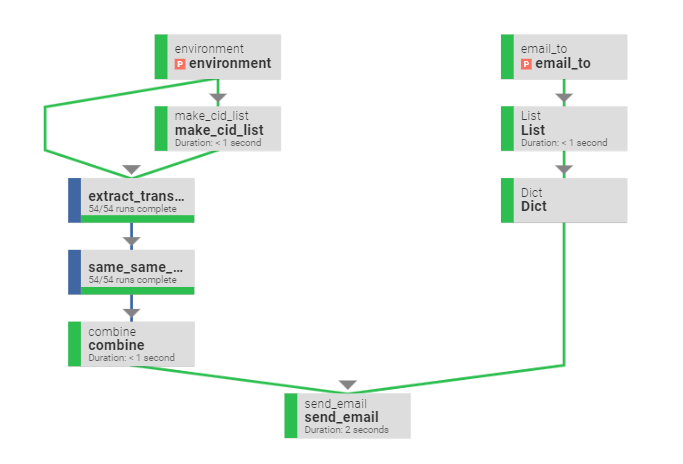
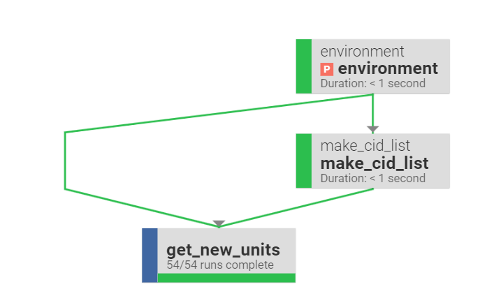

# samples

Here's a small sample of my work:
- invoice_audit.py - this script runs a few fraud/audit tests and sends an email with the result
  - Prefect Flow Run Schematic:
  
- alt_c_unit.py - extract new stores added to the db, build regexes based on store addresses and load into a specific db table
  - Prefect Flow Run Schematic - note: get_new_units spawns 54 subtasks
  